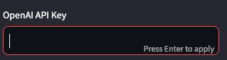
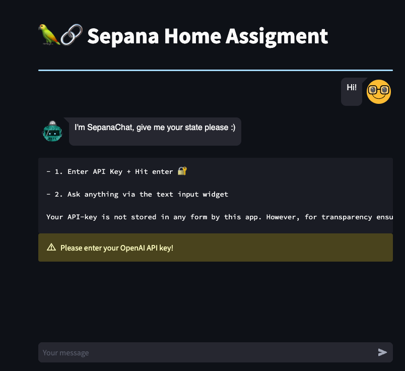
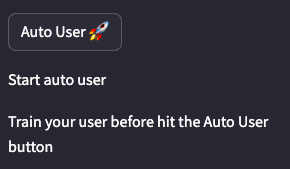

# Sepana Home Assignment

This repository contains the implementation for the Sepana home assignment, which involves developing a smart chatbot that can generate states based on a given story and interact with the user.

## Description

The chatbot is designed to create a conversational experience by generating multiple states based on a given story scenario. The user is presented with different options or choices derived from the story, and they can select one of the options to continue the conversation. The chatbot utilizes a loop to iterate through the user's responses and generate new states based on their choices.

Additionally, the chatbot employs a machine learning model that learns from the user's behavior. After the initial conversation, a new bot, trained on the user's interactions, takes over and generates responses on behalf of the original bot. This allows the chatbot to adapt and provide more personalized answers.

## Features

- Generates multiple states based on a given story scenario.
- Presents options or choices to the user for interaction.
- Implements a loop to continue the conversation based on the user's selected options.
- Utilizes a machine learning model to learn from the user's behavior.
- Transitions to a new bot that provides personalized responses based on user interactions.

## Installation

To use the Sepana home assignment chatbot, follow these steps:

1. Clone the repository:

```bash
git clone https://github.com/shahafp/sepana.git
```

# How To:

Enter your OpenAI key: it does not save the key (I promise :) )



In the main screen you will see a welcome messages.
Insert in the chat line your scenario and start chatting 



Some example scenarios for you:
```bash
Citizen A is in the process of buying a car from a private seller.
 A friend recommends a trusted mechanic to inspect the car before finalizing the purchase. 
 Citizen A contacts the mechanic, introduces themselves, and explains that they are interested in buying a used car with an asking price of $10,000. 
 They request the mechanic's assistance in conducting a thorough inspection to ensure the car is in good condition and to provide a report on its mechanical status before negotiating the final price.
```

```bash
Citizen X is exploring the possibility of starting a new tech startup. 
They have been recommended by a close associate to consult a renowned startup advisor who specializes in evaluating startup opportunities. 
Citizen X contacts the advisor, introduces themselves, and provides an overview of the tech startup they plan to establish. 
The initial funding requirement is $500,000. 
Citizen X seeks the advisor's expertise to perform a comprehensive assessment of the startup, 
including analyzing the business plan, evaluating the market potential, and assessing the competitive landscape. 
They request the advisor's confirmation regarding the viability and potential for success of the startup, 
aiming to determine if it is a worthwhile investment opportunity worthy of further exploration and funding considerations.
```

## How to end the chat?
To end the chat as a user just answer the state number as you wish and add the word END
It foes not matter the order of the things. for example: 2 END or END 2

## Auto User
Once you fill you gave enough examples you can use the AutoUser button



Then provide a new scenario in the text box and wait, it is initializing some parameters,
so it might take a second or two :)

### Enjoy!!